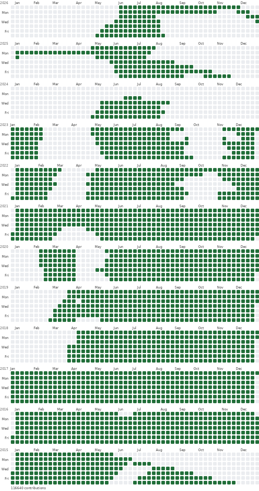

# github-bad-apple

Print a video onto GitHub's contribution graph, the green squares on a profile
page, using GitHub's own geometry, palette and year layout. The flagship demo is
the original Bad Apple!! film pressed into a stack of contribution years: the
poster is the film, and scrolling it is playback.



## Examples

* [Six frames](docs/poster-6-frames.svg)
* [Three frames](docs/poster-3-frames.svg)

## How the graph is emulated

A contribution year is a **53 × 7 grid**: 53 columns of weeks, Sunday first, by
7 rows of weekdays, one cell per day. Each cell holds a contribution count, and
the count is bucketed into five colours:

| count | level | colour |
|-------|-------|--------|
| 0 | 0 | `#ebedf0` |
| 1–9 | 1 | `#9be9a8` |
| 10–19 | 2 | `#40c463` |
| 20–39 | 3 | `#30a14e` |
| 40+ | 4 | `#216e39` |

A band starts on the Sunday on or before 1 January and runs 371 days, which is
53 × 7. The first and last week of a band therefore always spill a few days into
the neighbouring years. GitHub leaves those days empty, and so does this
renderer unless you pass `--fill` to `print`, because painting 28 December into
the 2026 band would claim contributions on a date the profile has no cell for.

## How a film fits into it

A year holds 371 cells and nothing else. Three measurements decide what happens
next, and all three point the same way: a smaller subject, drawn with less ink
per cell.

**Seven rows cannot hold a 4:3 frame.** Bad Apple!! is silhouette animation, a
figure that fills a good part of the frame, so printed into a single 7.5:1 band
it comes out as an unrecognisable smear. Each frame is instead printed across
`--bands` consecutive year bands, three by default, which gives it 53 × 21 cells
and a figure that reads as a figure, at the price of three years of history per
frame of film.

**The subject is cropped per frame.** `--fit subject` finds the ink and keeps a
window around it, so a character occupying a third of the frame fills the band
instead of a third of it. The window is square because the band is 7.5:1, and
anything wider would squeeze the figure. `crop` keeps the widest strip matching
the band's aspect, `squash` keeps everything and distorts it.

**Cells are reduced by ink coverage, not brightness.** `--pool coverage` counts
how much of a cell is ink. Averaging greys the silhouette out, because a
silhouette is a large flat area of mid grey rather than a shape, and `max`
inflates the glow around the figure, since an antialiased edge pixel is as
bright as the figure itself. Counting ink keeps the shape and leaves
`--threshold` in charge of what counts as drawn.

Frames map onto years in order, newest year on top, the way a profile reads:

```
frame 0  ->  years 1868-1870   (oldest, printed first, at the bottom)
frame 1  ->  years 1871-1873
...
frame 52 ->  years 2024-2026   (newest, at the top of the poster)
```

Fifty-three frames of Bad Apple!! (3:39) become 159 years of profile history,
one frame every four seconds or so. The newest band is the current year, so in
2026 the poster spans 1868 to 2026. Each frame's top row lands in the newest of
its three bands, so the picture reads top-down.

## Requirements

* Python 3.10 or newer
* `ffmpeg` and `ffprobe` on `PATH`
* Pillow, for PNG, GIF and MP4 output: `pip install -r requirements.txt`
  (the renderers call `load_default(size=...)`, so 10.1 is the floor)

Nothing else: no install step, no package to build, run it from the folder.

## Quick start

```bash
python3 main.py
```

That opens the settings menu: pick a number, type the new value, come back to
the menu, press Enter on an empty line to start or `q` to quit. The menu and the
settings block at the top of `main.py` are in Turkish, and they drive the same
code as the command line below. Set `AYAR_SOR = False` there to skip the menu.

```bash
# the film as an SVG, as a PNG (--scale is the pixel multiplier), or as text
python3 -m badapple print assets/bad_apple.mp4 -o out/bad_apple.svg
python3 -m badapple print assets/bad_apple.mp4 -o out/bad_apple.png --scale 1
python3 -m badapple print assets/bad_apple.mp4 --frames 3

# play it in the terminal, exporting a GIF or an MP4 along the way
python3 -m badapple play assets/bad_apple.mp4 --fps 12 --gif out/bad_apple.gif
python3 -m badapple play assets/bad_apple.mp4 --frames 60 --fps 6 --mp4 out/bad_apple.mp4 --once

# the comparison video: the film on the left, the graph on the right
python3 -m badapple compare assets/bad_apple.mp4 -o out/compare.mp4 --frames 2628 --fps 12
```

## Flags

`video` is the positional argument in all three commands.

### print

| flag | meaning |
|------|---------|
| `-o`, `--out` | `.svg`, `.png` or `.txt`; anything else falls back to text (default: text on stdout) |
| `--frames N` | frames sampled across the film (default 53) |
| `--bands K` | year bands each frame is printed across (default 3) |
| `--fit {subject,crop,squash}` | how much of the frame to keep (default `subject`) |
| `--pool {coverage,max,area}` | how a window becomes cells (default `coverage`) |
| `--threshold F` | ink coverage needed to light a cell (default 0.5) |
| `--crop-threshold F`, `--margin F` | what counts as subject (default 0.35) and room around it (default 0.15) |
| `--shade` | quantise partial coverage into the four green levels |
| `--invert` | treat dark pixels as ink, for light-background sources |
| `--level 0..4` | green level used for solid ink (default 4, the darkest) |
| `--fill` | also print the days belonging to the neighbouring years |
| `--start-year Y` | year of the newest band (default: this year) |
| `--scale N` | PNG pixel scale (default 2; SVG and text ignore it) |
| `--stats` | ink statistics on stderr |

### play

| flag | meaning |
|------|---------|
| `--fps F` | playback rate (default 15) |
| `--frames N` | sampled frames (default: fps × duration, so a real-time pass) |
| `--zoom N` | repeat every cell N times (default 1) |
| `--once` | play a single pass and exit instead of looping |
| `--gif PATH` | also write an animated GIF |
| `--mp4 PATH` | also write an H.264/MP4 |
| `--gif-scale N`, `--mp4-scale N` | pixel scale of the export (default 1) |
| `--crf N` | MP4 quality, lower is better (default 18) |
| `--no-color` | shade blocks instead of 24-bit colour |
| `--start-year Y` | year the frames are placed in (default: this year) |

Every `print` ink flag works here too, and there is no `--fill`: the animation
presses each frame onto throwaway years and shows the newest bands, where the
first and last columns would otherwise be cut off. The bands are drawn with half
blocks, two cell rows per terminal row, so three bands play in eleven terminal
rows; without a terminal, or with `--no-color`, shade blocks take over.

### compare

| flag | meaning |
|------|---------|
| `-o`, `--out` | the MP4 to write (required) |
| `--frames N` | frames sampled across the film (default 53) |
| `--fps F` | frame rate of the export (default 12) |
| `--music` | `source`, `generated`, `none`, or a path to a file (default `source`) |
| `--crf N` | video quality, lower is better (default 18) |
| `--no-labels` | drop the `ORIGINAL` and `CONTRIBUTION GRAPH` captions |
| `--start-year Y` | year the frames are placed in (default: this year) |

Every `print` ink flag (`--bands`, `--fit`, `--pool`, `--threshold`,
`--crop-threshold`, `--margin`, `--shade`, `--invert`, `--level`) works here too.

## Making it slower

Two knobs pull against each other. `--frames` says how many moments of the film
are sampled, `--fps` says how long each of them is held, and the loop lasts
`frames / fps` seconds:

```bash
--frames 40 --fps 2      # 20 s loop, 500 ms per frame
--frames 90 --fps 12     # 7.5 s loop, 83 ms per frame
--frames 24 --fps 1      # 24 s loop, one frame per second
```

A GIF stores its frame delay in hundredths of a second, so `--fps 2` and below
are written faithfully and anything faster is truncated to 10 ms granularity. The
limiting factor is usually the file manager, not the file: some ignore delays
above a couple of seconds, some round them, and thumbnail panes often show only
the first frame. An MP4 sidesteps all of that, being played by the same player
as any other video.

## The comparison video

`compare` writes one MP4 with the film on the left and the same moments printed
on the right, each labelled, so the result plays like a video rather than
looking at a poster next to a clip. The soundtrack is chosen with `--music`:
`source`, the default, hands the film to ffmpeg as a second input and muxes its
own audio track straight in, so the song is the real one and in sync by
construction, with `-shortest` trimming it to the length of the frames.
`generated` synthesises a two-voice chiptune loop, Am–F–C–G with the lead
arpeggiating the chord tones, into a temporary file that is deleted afterwards.
`none` is silent, and anything else is taken as a path to a file of your own.
Streams are mapped explicitly, so a video input can never displace the rendered
frames. Frames are sampled across the whole film, so `--frames` decides the
length: 2628 frames at 12 fps is the full 219 seconds of Bad Apple!! at real
speed, and it takes a few minutes to render.

## Library use

```python
from badapple import Printer, read_bitmaps, render_png

frames = read_bitmaps("assets/bad_apple.mp4", count=24, size=(53, 21), bands=3)
poster = Printer(start_year=2026).print_film(frames, years=24)
render_png(poster.bands(), scale=1).save("out/poster.png")
```

`read_bitmaps` decodes the film once and does the windowing and the cell
reduction in Python, so the same decoded frames can be printed at any band
count. `print_film` samples them evenly over time; `bands()` gives the printed
years newest first, the order a profile reads them in.

## Tests

```bash
pip install -r requirements-dev.txt
python3 -m pytest
```

116 tests cover the date geometry, the colour buckets, the subject window, the
three pooling modes, the band layout, all three renderers, the sound paths and
the CLI. The ffmpeg-backed ones build their own one-second clip and skip when
ffmpeg is not installed; the rest are pure Python.

## Credits and licence

The video is not in this repository. Bad Apple!! is (c) 2007-2008
has'n'/Anarchy and is distributed by its author, so fetch your own copy and pass
any path to the tool; `assets/bad_apple.mp4` is the path the settings file
expects. The code is MIT licensed.
